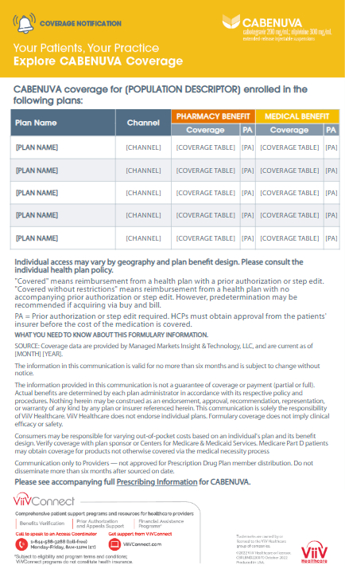
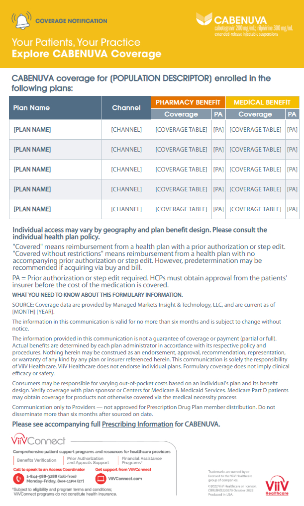

## Table of contents

- [Overview](#overview)
  - [Notes](#notes)
  - [Screenshot](#screenshot)
  - [Links](#links)
- [My process](#my-process)
  - [Built with](#built-with)
  - [Useful resources](#useful-resources)
- [Author](#author)

## Overview

### Notes

 - Grid border lines in heading of table are white, whereas in table they are specified #b9c5ce.

### Screenshot

### Links

- Solution URL: [GitHub Repo](https://github.com/SteveNoyes/html-assessment)
- Live Site URL: [GitHub Pages](https://stevenoyes.github.io/html-assessment/)

## My process

### Built with

- HTML1

- CSS 

### Useful resources

- [Irregular Table Headings](https://www.w3.org/WAI/tutorials/tables/irregular/) - table heading that spans multiple rows while still contained

- [text spacing](https://www.w3schools.com/css/css_text_spacing.asp) - Spacing for the top header was made easier with this.

- [realtive width percentage](https://www.w3schools.com/html/html_table_sizes.asp) - table relative sizing

- [meta data](https://www.goodemailcode.com/email-code/template.html) - email meta data 

### Testing

- [caniemail](https://www.caniemail.com/) - easy reference for testing and troubleshooting

- [CSS Browser Compatibility](https://www.campaignmonitor.com/css/) - turns stylesheet in head into inline css. Much easier than writing inline css.

- [test for browser inconsistencies](https://www.htmlemailcheck.com/check/) - check for common mistakes and browser inconsistencies.

## Author

- Website - [Portfolio](https://www.stevenmnoyes.com)
- GitHub - [SteveNoyes](https://github.com/SteveNoyes)